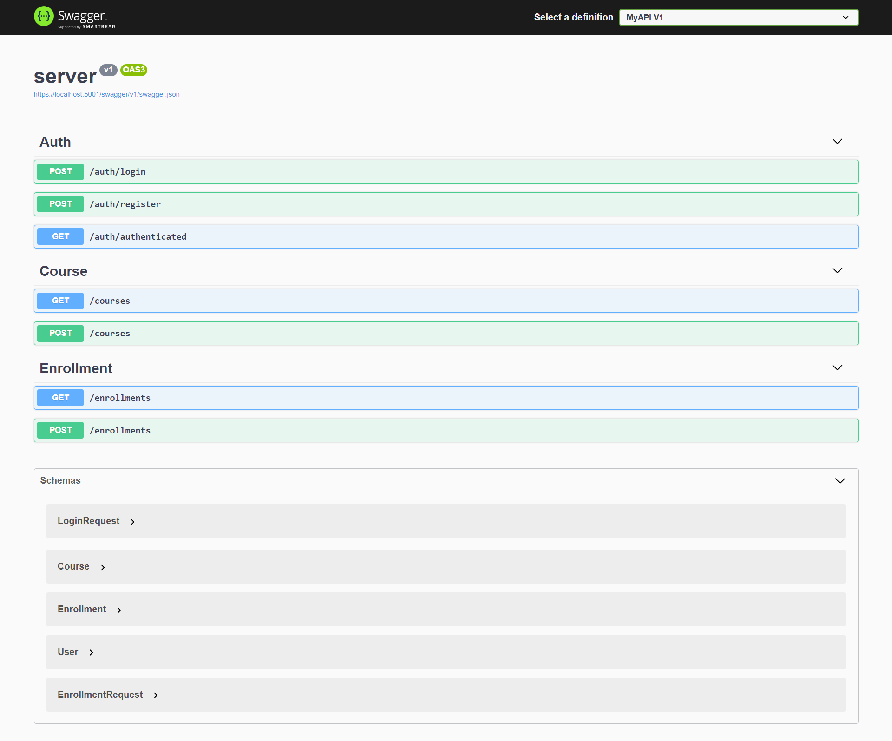
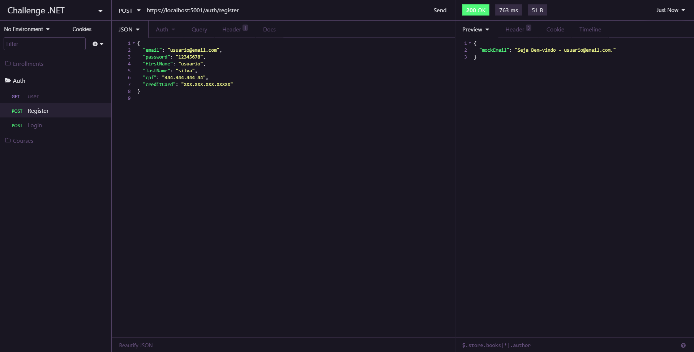

    
    <h1>
        Seleção .NET
    </h1>   

## Descrição

Sistema educacional simples proposto como desafio da etapa de avaliação técnica.

## Critérios de Avaliação

[Disponível aqui](/.github/evaluation_criteria.md)

## Features
[x] Cadastro e autenticação de usuário na plataforma (com um cartão de crédito vinculado a sua conta) com JWT.  
[x] Listagem de cursos na plataforma.  
[ ] Matrícula

## Stack

- [ASP.NET](https://dotnet.microsoft.com/apps/aspnet)
- [Angular](https://angular.io/)

## UI - User Interface

## API Documentation

#### [Swagger](/.github/evaluation_criteria.md)

#### [Insomnia Exports - HTTP Client](/.github/evaluation_criteria.md)

